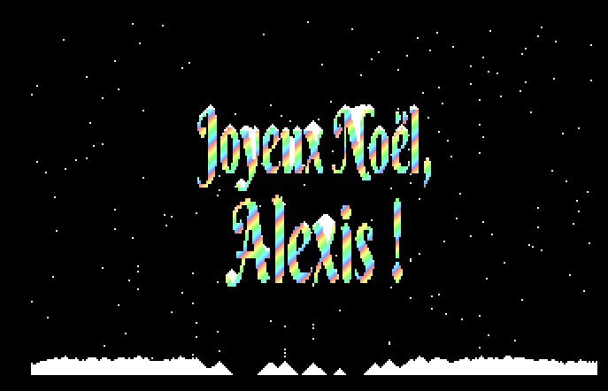
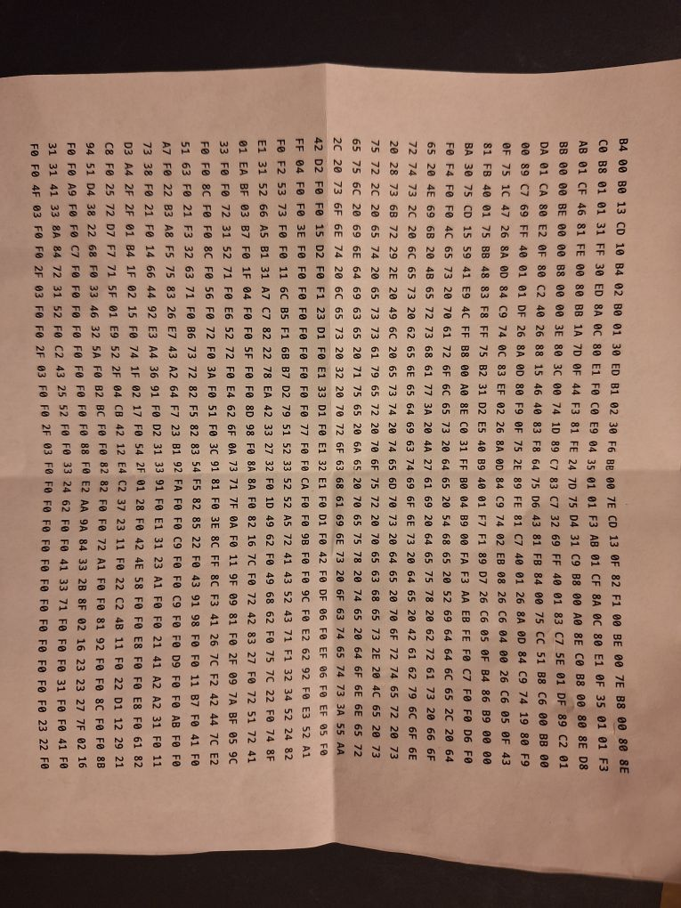

# Happy Holidays bootloader

x86 boot-sector program that shows a rainbow-coloured "Joyeux Noël, Alexis !" ("Happy Holidays, Alexis!" in French) message on the screen.
Technically it's a boot sector + another for some of the graphics (total 1024 bytes), as even compressed they wouldn't fit in a single sector.



Assembly:

```console
nasm -f bin boot.asm -o boot.bin
```

Running (in QEMU):

```console
qemu-system-x86_64 -drive format=raw,file=boot.bin
```

You can also totally flash this to a USB drive and boot from it on bare metal and it should work.
You just need to make sure CSM is enabled on UEFI-only systems.

Calling this "Happy Holidays" instead of "Merry Christmas" because apparently "Happy Holidays" is "woke" and there's this war on Christmas apparently and I don't know exactly what  the deal is but some losers get worked up by this and I think it's funny.

## The riddle

This was meant as a riddle for [Alexis](https://github.com/Alexisloic21) to solve during a secret Santa.
The hexdump was printed out on a piece of paper with no further explanation:



[Ben](https://stuerz.xyz/) inspired me to do this, this is not an original idea :)

## Improvements

The following pattern:

```x86asm
mov cl, [es:di]
test cl, cl
```

Can be simplified with just a single `cmp`.
